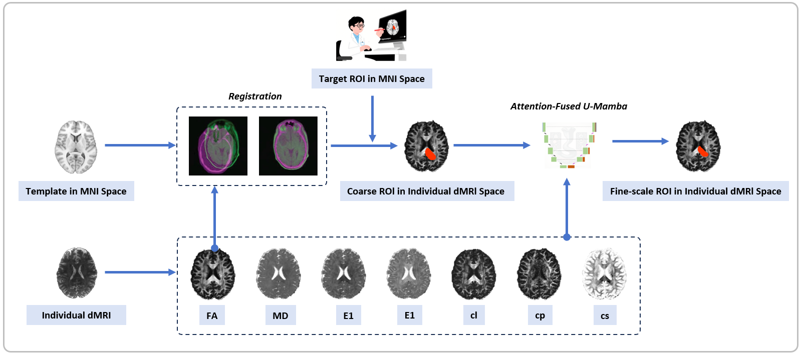

# RefParcel
RefParcel: reference-driven attention-fused U-Mamba for arbitrary anatomical fine-scale parcellation from diffusion MRI
## Overview
This repository contains the implementation of **RefParcel**, a deep learning framework designed for arbitrary anatomical fine-scale parcellation from diffusion MRI (dMRI).  
The method integrates a nonlinearly registered standard atlas as spatial priors with seven diffusion-derived features, and leverages a hybrid U-Mamba architecture enhanced with channel attention to effectively capture both local and global structural characteristics.  


## Create a Virtual Environment
```bash
conda create -n RefParcel_env python=3.10 -y
```
## Install PyTorch 2.0.1
```bash
pip install torch==2.0.1 torchvision==0.15.2 --index-url https://download.pytorch.org/whl/cu118
```
## Install Other Dependencies
```bash
pip install "causal-conv1d>=1.2.0"
pip install mamba-ssm --no-cache-dir
```
```bash
cd umamba
pip install -e .
```
## Registration
- **Spatial Alignment:** `fa_ants.py`  
  Perform spatial alignment of images.
- **Label Mapping:** `fa_ants_seg.py`  
  Map labels after alignment.
## Dataset Format
The dataset should be organized in the [`nnU-Net`](https://github.com/MIC-DKFZ/nnUNet/blob/master/documentation/dataset_format.md) format.
To verify the dataset integrity, run:
```bash
nnUNetv2_plan_and_preprocess -d <DATASET_NAME> --verify_dataset_integrity
```
## Training
```bash
nnUNetv2_train <DATASET_NAME> 3d_fullres all -tr nnUNetTrainerUMambaBot
```
## Prediction
```bash
nnUNetv2_predict -i <INPUT_FOLDER> -o <OUTPUT_FOLDER> -d <DATASET_NAME> -c 3d_fullres -f
```
